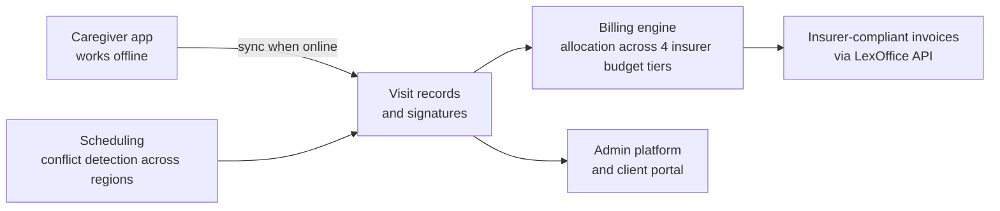
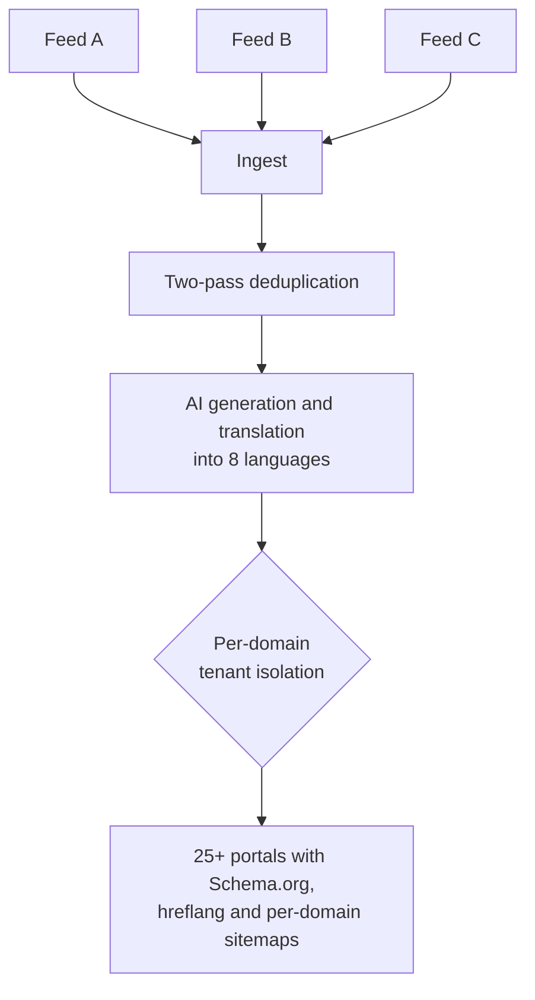
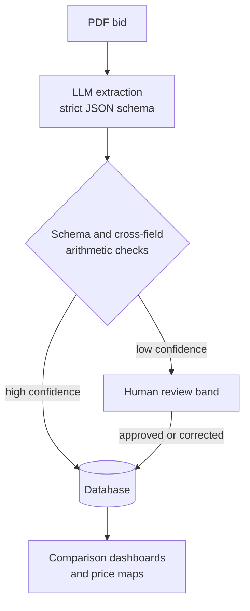
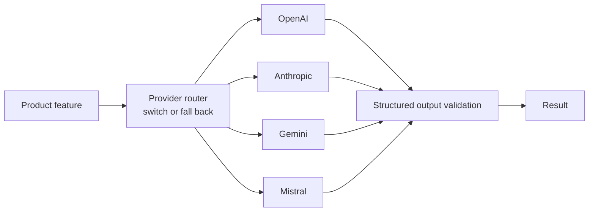

<picture>
  <source media="(prefers-color-scheme: dark)" srcset="https://raw.githubusercontent.com/cosmin-oros/cosmin-oros/main/assets/hero-dark.svg">
  
</picture>

  
  
  
  

Full-Stack Software Engineer at **GAIM Solutions**, an AI software company in Munich, where I have built five products for German businesses end to end: the mobile apps, the web platforms, the backends, the billing and the AI features inside them. Co-founder of **[SPEC24](https://spec24.dev)**, where I also own pricing, positioning and every customer conversation. I care most about the parts that keep software trustworthy once real people depend on it: explicit state machines for messy workflows, mobile apps that keep working offline, billing logic that is tested rather than trusted, and AI output that is checked before anyone acts on it. Earlier: Continental, Nokia and [e-spres-oh].

<picture>
  <source media="(prefers-color-scheme: dark)" srcset="https://raw.githubusercontent.com/cosmin-oros/cosmin-oros/main/assets/impact-dark.svg">
  
</picture>

## Selected work

  <a href="https://cosmin-oros-dev.vercel.app/"><picture><source media="(prefers-color-scheme: dark)" srcset="https://raw.githubusercontent.com/cosmin-oros/cosmin-oros/main/assets/card-care-dark.svg"></picture></a>
  <a href="https://cosmin-oros-dev.vercel.app/"><picture><source media="(prefers-color-scheme: dark)" srcset="https://raw.githubusercontent.com/cosmin-oros/cosmin-oros/main/assets/card-moxios-dark.svg"></picture></a>
  <a href="https://cosmin-oros-dev.vercel.app/"><picture><source media="(prefers-color-scheme: dark)" srcset="https://raw.githubusercontent.com/cosmin-oros/cosmin-oros/main/assets/card-tenders-dark.svg"></picture></a>
  <a href="https://spec24.dev"><picture><source media="(prefers-color-scheme: dark)" srcset="https://raw.githubusercontent.com/cosmin-oros/cosmin-oros/main/assets/card-spec24-dark.svg"></picture></a>

<b>Under the hood: offline-first mobile and a billing engine that has to be right</b>

 

- **Built for the field, not the office.** Caregivers document visits and capture signatures on a phone with no signal, and the app reconciles when it is back online.
- **Rules learned from the people who ran the process.** The insurer budget tiers were modelled with the staff who used to allocate them by hand, so the automation matches how care is actually billed.
- **Whole workflow, one system.** Scheduling, documentation and invoicing had been spread across paper and spreadsheets. Now they run end to end in three apps that share one backend.

<b>Under the hood: one codebase, 25+ portals</b>

 

- **Tenancy by domain.** Every portal gets isolated data, its own sitemap, hreflang and Schema.org markup from a single deployment.
- **Clean input.** A two-pass deduplication algorithm runs over continuously arriving feeds, so the same event never appears twice.
- **Content at scale.** An OpenAI layer generates and translates content into 8 languages, bringing in thousands of impressions and clicks each month.

<b>Under the hood: document AI that people stopped double-checking</b>

 

- **Schema first.** The model fills a strict JSON schema, so malformed output fails loudly instead of reaching the database.
- **Arithmetic as a guardrail.** Quantities, unit prices and line totals have to reconcile before a row is accepted.
- **People only where they add value.** Low-confidence results go to a review band, everything else flows straight through. Users stopped re-checking extractions by hand.
- **Measured against ground truth.** Extraction quality is validated against labelled documents, not judged by eye.

<b>Under the hood: the model layer</b>

 

- **No single-vendor lock-in.** OpenAI, Anthropic, Gemini and Mistral sit behind one interface, so a feature can switch or fall back between providers.
- **Only where it earns its place.** Most of these products are deterministic. The model handles the part that was genuinely unstructured, and everything around it is ordinary, tested software.
- **Beyond completions.** MCP servers and agent tooling connect models to real systems and data.

## How I work

- **Start with the person who runs the process.** The billing rules in Alltagshelden24 came from the people who did it by hand, before any of it was modelled.
- **Make correctness visible.** State machines for messy workflows, arithmetic checks on extracted data, end-to-end tests on the paths that matter.
- **Own the outcome, not the ticket.** At SPEC24 that meant pricing, launch and support as well as the code.

Claude Code is my daily environment: project-scoped skills and slash commands so workflows repeat, code review running as a skill on every change, and Playwright end-to-end suites driven through MCP servers. It is leverage, not a substitute for judgment. Every line still gets read, tested and shipped under my name. The same setup built SPEC24's launch pipeline: Remotion videos, lead generation and email marketing.

## Stack

<picture>
  <source media="(prefers-color-scheme: dark)" srcset="https://raw.githubusercontent.com/cosmin-oros/cosmin-oros/main/assets/stack-dark.svg">
  
</picture>

## Activity

<picture>
  <source media="(prefers-color-scheme: dark)" srcset="https://raw.githubusercontent.com/cosmin-oros/cosmin-oros/main/assets/activity-dark.svg">
  
</picture>
